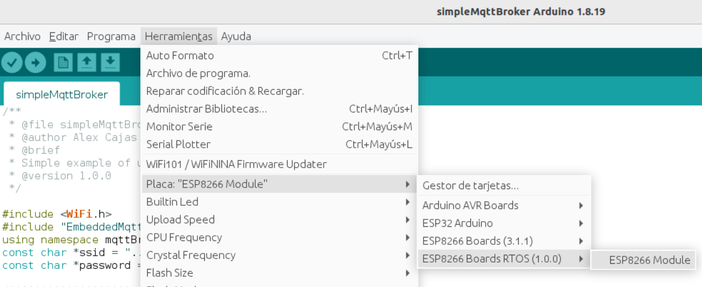
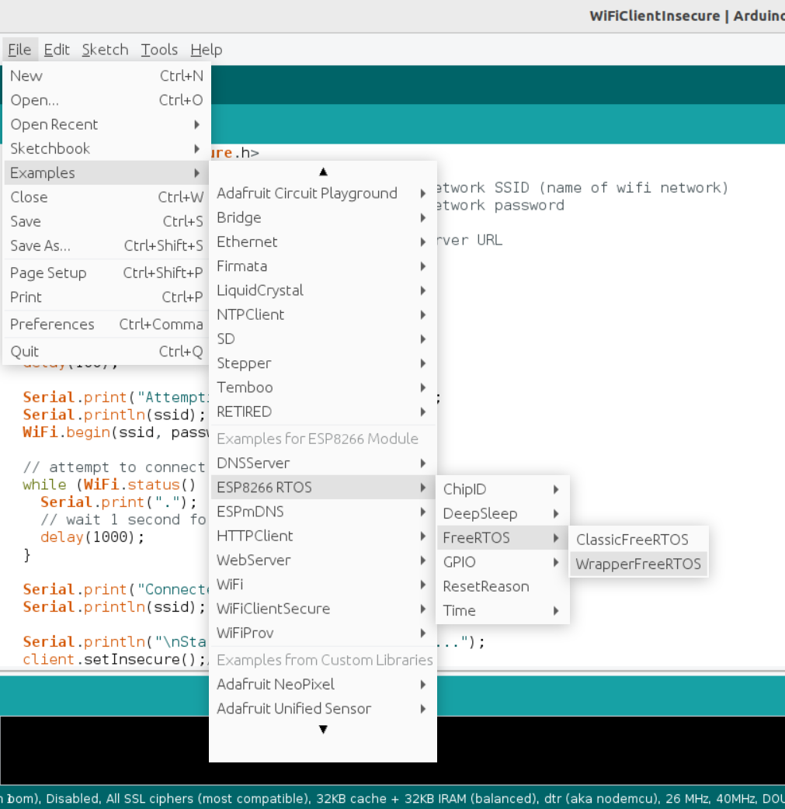

# ESP8266RTOSArduCore

Arduino core for [ESP8266_RTOS_SDK](https://github.com/espressif/ESP8266_RTOS_SDK), a light version of FreeRTOS, supported by espressif.

RTO_SDK share the same framework with esp-idf [https://github.com/espressif/esp-idf], so this project is based on esp32 arduino core [https://github.com/espressif/arduino-esp32], (version 1.0.6), to provide compatibility between esp32 arduino libraries and this core.

# Branchs

* **main**: lastest release version.
* **stable**: stable version with some update ahead of main branch to test and fix.
* **develop**: development branch to merge new features before to pull to stable version.

---

# Index

* [Features](https://github.com/alexCajas/esp8266RTOSArduCore/tree/main#features)
* [Installation](https://github.com/alexCajas/esp8266RTOSArduCore/tree/main#installation)
* [Examples](https://github.com/alexCajas/esp8266RTOSArduCore/tree/main#examples)
* [Limitations](https://github.com/alexCajas/esp8266RTOSArduCore/tree/main#limitations)
* [To Do List](https://github.com/alexCajas/esp8266RTOSArduCore/tree/main#to-do-list)
* [List of remaining core files to adapt test and fix](https://github.com/alexCajas/esp8266RTOSArduCore/tree/main#list-of-core-files-to-adapt-test-and-fix)
* [List of remaining basic libraries to Test and fix](https://github.com/alexCajas/esp8266RTOSArduCore/tree/main#list-of-basic-libraries-to-test-and-fix)
* [Links of interest](https://github.com/alexCajas/esp8266RTOSArduCore/tree/main#links-of-interest)

---

# Features

* Provides FreeRtos concurrency utilities.
* Share framework with esp32 arduino core.
* Compatibility with esp32 arduino libraries.
* Easy installation with arduino board manager.
* Include [WrapperFreeRTOS](https://github.com/alexCajas/WrapperFreeRTOS) library to implement concurrent objects.
* Include [EmbeddedMqttBroker](https://github.com/alexCajas/EmbeddedMqttBroker) library like mqtt broker.

# Installation

You can install this core using arduino board manager with this package index 
:

~~~
https://raw.githubusercontent.com/alexCajas/esp8266RTOSArduCore/main/package/package_esp8266RTOS_index.json
~~~

Then you need to install esp8266_RTOS_SDK requirements in your system:

* Go to your arduino cores installation directory, tipically:
   
~~~
cd ~/.arduino15/packages/esp8266RTOS/hardware/esp8266RTOS/1.0.0 
~~~

* In this path you will find the file requirementes.txt, install that using pip:

~~~
pip3 install -r requirements.txt
~~~

* Select esp8266 boards RTOS:

* **Now you are ready to write and install sketchs using Arduino IDE or VScode IDE!**

# Examples

* **Basic blink example**
~~~

/*
* Based on arduino esp32 arduino core FreeRTOS.ino example.
*/

#ifndef LED_BUILTIN
#define LED_BUILTIN 2
#endif

// define two tasks for Blink
void TaskBlink( void *pvParameters );

// the setup function runs once when you press reset or power the board
void setup() {
  
  // initialize serial communication at 115200 bits per second:
  Serial.begin(115200);
  
  // Now set up tasks to run independently.
  xTaskCreatePinnedToCore(
    TaskBlink
    ,  "TaskBlink"   // A name just for humans
    ,  1024  // This stack size can be checked & adjusted by reading the Stack Highwater
    ,  NULL
    ,  2  // Priority, with 3 (configMAX_PRIORITIES - 1) being the highest, and 0 being the lowest.
    ,  NULL 
    ,  ARDUINO_RUNNING_CORE); // in esp8266 allways is 0

  // Now the task scheduler, which takes over control of scheduling individual tasks, is automatically started.
}

void loop()
{
  // do nothing.
}

void TaskBlink(void *pvParameters) 
{
  pinMode(LED_BUILTIN, OUTPUT);

  while (true) // A Task shall never return or exit.
  {
    digitalWrite(LED_BUILTIN, HIGH);   // turn the LED on (HIGH is the voltage level)
    vTaskDelay(pdMS_TO_TICKS(500)); 
    digitalWrite(LED_BUILTIN, LOW);    // turn the LED off by making the voltage LOW
    vTaskDelay(pdMS_TO_TICKS(500)); 
  }
}

~~~

* More examples in 
~~~
~/.arduino15/packages/esp8266RTOS/hardware/esp8266RTOS/1.0.1/libraries/ 
~~~

# Limitations

* The compatibility between libraries of esp8266ArduinoCore based on NONOSDK, and this core, esp8266RTOSArduCore based on FreeRTOS is limited, in general you can use the same esp8266ArduinoCore libraries that have compatibily with esp32 arduino core. 

* It is assumed that external third-party-libaries are in ~/Arduino/libraries.

* There is not supported to recursive includes to external libraries, all libraries you need must be includes in your .ino scketch:
	*  **example incorrect include**:

**~/Arduino/libraries/libraryOne/headerOne.h**:

~~~
#include "headerTwo.h"
~~~

**scketchs.ino**:
~~~
#include "headerOne.h"

// sdk don't loock for headers into heraderOne.h!, headerTwo.h is not included in to compile process, so librariOne is not linked with headerTwo in compile time.
~~~

* **Rigth way to include**:
	
**~/Arduino/libraries/libraryOne/headerOne.h**:
~~~
#include ""headerTwo.h
~~~

**scketchs.ino**:
~~~
#include "headerOne.h"
#include "headerTwo.h"
// now compiler use all data of headerTwo.h to compile and link with headerOne.h and scketchs.ino. 
~~~

* **Note: if you remove #include "headerTwo.h" of "headerOne.h", libraryOne will  not be linked with "headerTwo.h" even if you include that in sckets.ino.**

* The build process use bash scripts, so you can only use this core on Linux, ubuntu etc... OS, changing bash scripts to python to support other operating systems is still in development.

* libraries or utilities for specific hardware of esp32, like bluetooth or hall sensor is not supported in this core.

* set compile option is not supported yet.

* for now only support generic board esp8266 pins map, that is only for the way to name gpios pin in scketchs. You can install scketchs in others boards using generic name of gipo pins.  

* It is not supported changes deboug level info from IDE yet, you need to changes it manually in esp32-hal-log.h

# To Do List

- [ ] Implement way to resolve recursive includes.
- [ ] Rewrite paltafrom.txt to give support to compile options. 
- [ ] Add esp8266 boards configurations in boards.txt
- [ ] Add pins map support for more models of esp8266 boards.
- [ ] Changes bash scripts to python scripts to support more OS.
- [ ] adapt, test and fix remaining core files with hardware dependencies of esp32 core. [See this section](https://github.com/alexCajas/ESP8266RTOSArdu/tree/main#list-of-core-files-to-adapt-test-and-fix). 
- [ ] Test and fix remaining basic libraries of esp32 core. [See this section](https://github.com/alexCajas/ESP8266RTOSArdu/tree/main#list-of-basic-libraries-to-test-and-fix).
- [ ] Think in add #if TARGET_CONF_esp32 to more compatibility. --> I think that is a good idea because RTOS is more ligth than FreeRtos.

# List of core files to adapt test and fix

- [ ]  core/esp8266/esp32-hal-adc.c
- [ ]  core/esp8266/esp32-hal-i2c.c
- [ ]  core/esp8266/esp32-hal-i2c-slave.c
- [ ]  core/esp8266/esp32-hal-psram.c
- [ ]  core/esp8266/esp32-hal-sigmadelta.c
- [ ]  core/esp8266/esp32-hal-spi.c
- [x]  core/esp8266/esp32-hal-time.c
- [ ]  core/esp8266/esp32-hal-timer.c
- [ ]  core/esp8266/Tone.cpp
- [ ]  core/esp8266/esp32-hal-tinyusb.c ?
- [x]  core/esp8266/base64.cpp
- [x]  core/esp8266/cbuf.cpp  
- [x]  core/esp8266/esp32-hal-time.c
- [x]  core/esp8266/esp32-hal-cpu.c
- [x]  core/esp8266/esp32-hal-gpio.c
- [x]  core/esp8266/esp32-hal-misc.c
- [x]  core/esp8266/esp32-hal-uart.c
- [x]  core/esp8266/Esp.cpp
- [x]  core/esp8266/FunctionalInterrupt.cpp
- [x]  core/esp8266/HardwareSerial.cpp
- [x]  core/esp8266/IPAddress.cpp
- [x]  core/esp8266/IPv6Address.cpp
- [x]  core/esp8266/libb64/cdecode.c
- [x]  core/esp8266/libb64/cencode.c
- [x]  core/esp8266/main.cpp
- [x]  core/esp8266/MD5Builder.cpp
- [x]  core/esp8266/Print.cpp
- [x]  core/esp8266/stdlib_noniso.c
- [x]  core/esp8266/Stream.cpp
- [x]  core/esp8266/StreamString.cpp
- [x]  core/esp8266/wiring_pulse.cpp
- [x]  core/esp8266/wiring_shift.cpp
- [x]  core/esp8266/WMath.cpp
- [x]  core/esp8266/WString.cpp

# List of basic libraries to Test and fix

- [x] WiFi
- [x] EmbeddedMqttBroker
- [x] WrapperFreeRTOS
- [x] WebServer
- [x] WiFiClientSecure
- [x] WiFiProv
- [x] HTTPClient
- [ ] HttpUpdate
- [ ] HttpUPdateServer
- [x] DNSServer
- [x] ESPmDNS
- [ ] AyncUDP?
- [ ] Update
- [ ] ArduinoOta
- [ ] EEPROM
- [x] ESP[32|8266] examples
- [ ] FFat
- [ ] FS
- [ ] NetBios
- [ ] Preferences?
- [ ] SD
- [ ] SDMMC?
- [ ] SPI
- [ ] SPIFFS
- [ ] Ticker
- [ ] Wire

# License

* esp8266_RTOS_SDK is under Apache-2.0 license.

# Links of interest

* [Official repo of esp8266 RTOS SDK](https://github.com/espressif/ESP8266_RTOS_SDK)
* [Esp8266 rtos sdk docu](https://docs.espressif.com/projects/esp8266-rtos-sdk/en/latest/)
* [esp32 arduino core repo](https://github.com/espressif/arduino-esp32)
* [Esp8266 arduino comunity](https://www.esp8266.com/viewforum.php?f=25)
